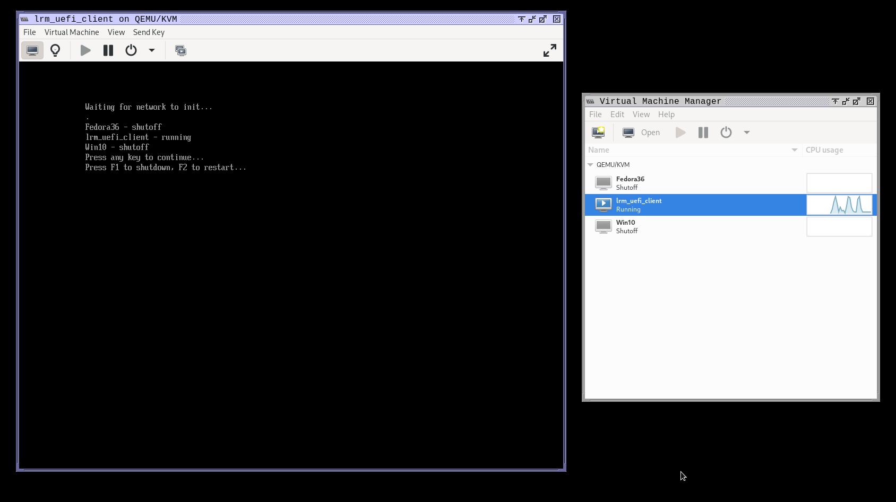

# lrm UEFI Client

Proof of concept [libvirt remote manager](https://github.com/Xalageus/libvirt_remote_manager) client running in a QEMU UEFI environment. Currently only displays names of vms with their status (shutoff/running).

## Screenshots

## Build

Simply run `make` to download and setup edk2 and build the client. Run `setupvm.sh` as root to install the client as a vm in libvirt.
